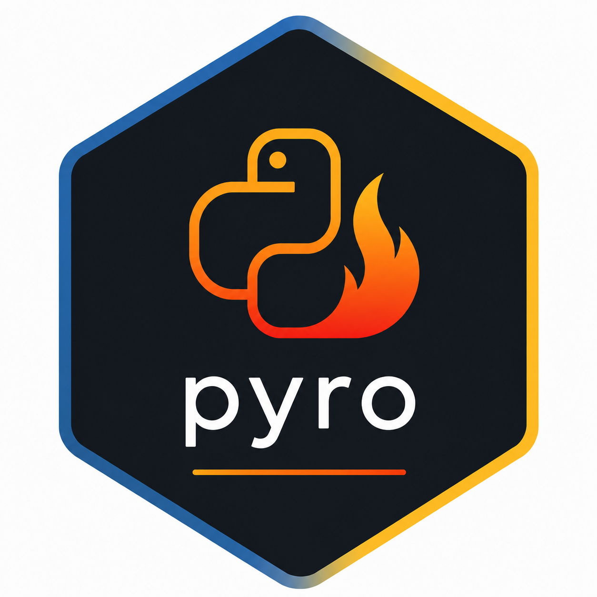

<!-- README.md is generated from README.Rmd. Please edit that file -->

# pyro 

<!-- badges: start -->

<!-- badges: end -->

`pyro` is the shared uv/Python plumbing for the `fyr` R-package
ecosystem (`reportifyr` and `presentifyr`). It wraps the
[uv](https://github.com/astral-sh/uv) CLI to install uv itself, if
missing, manage a project-local `pyproject.toml`, and materialize a
`.venv/` pinned by `uv.lock`.

It is designed to be called from sibling fyr-packages (which forward
their `initialize_*()` to `pyro`), but it can also be used directly in
any R project that wants reproducible Python deps.

## Installation

``` r
pak::pkg_install("a2-ai/pyro")
```

## How it works

`pyro` treats the **project’s own `pyproject.toml`** as the source of
truth for Python dependencies. `pyro` never owns or rewrites the user’s
pins. A call to `initialize_python()` walks four steps: seed (first init
only), register groups, audit drift, then lock + sync the `.venv/`, and
the bundled spec is a *reference*, not the installed set, so bumping a
pin in `pyro` never retroactively changes an existing project.

For the full lifecycle and the reference-vs-installed-set guarantee, see
`vignette("how-it-works")`.

## Quick start

### As an end user of a sibling fyr-package

Typical case: you don’t call `pyro` directly. The sibling package’s
initializer handles it.

``` r
reportifyr::initialize_report_project(here::here())
# or
presentifyr::initialize_app()
```

You’ll be prompted once to confirm `pyro` can install uv, Python, and
the pinned dependencies. Subsequent calls are idempotent and fast (uv
reports no work when the venv is already in sync).

### Directly, in any R project

``` r
pyro::initialize_python()                       # all groups
pyro::initialize_python(groups = "reportifyr")  # one group, additive
```

To run Python from R against the resulting venv:

``` r
paths <- pyro::get_venv_uv_paths()
pyro::run_python_script(
  uv_path     = paths$uv,
  venv_path   = paths$venv,
  args        = c("run", "-m", "my_module"),
  script_name = "my_module"
)
```

## Public API

Project-level (set up and inspect the environment):

| Function | Purpose |
|----|----|
| `initialize_python()` | Install uv, seed `pyproject.toml`, audit pins, run `uv lock` + `uv sync`. Prompts the user before touching their machine. |
| `write_group_to_pyproject(name, deps = NULL)` | Idempotently upsert a dependency group into the project’s `pyproject.toml`. Sibling packages call this from their wrappers; `deps` defaults to `pyro`’s bundled pins when `name` is a blessed group. |
| `get_proj_dir()` | Canonical resolver for the project root (`getOption("venv_dir")` if cached, else `here::here()`). The default for `pyproject_dir` / `venv_dir` arguments. |

Runtime (run Python and locate the toolchain):

| Function | Purpose |
|----|----|
| `get_venv_uv_paths()` | Return `list(uv = ..., venv = ...)`. Errors clearly if uv or `.venv/` are missing. |
| `run_python_script(uv_path, args, venv_path, script_name, ...)` | Run a Python script inside the venv via `processx::run()`. Supports optional `PYTHONPATH`, a `stderr_callback`, and a `verbose_env` passthrough. |
| `get_uv_path(quiet = FALSE)` | Pure lookup. Locate the uv binary on `PATH` or in known install locations, or `NULL` if absent. |
| `get_uv_version(uv_path)` | Parse `uv --version` for the installed version string. |

## Authoring a fyr-package

Sibling packages compose the two halves of the contract:

``` r
my_initialize <- function() {
  pyro::write_group_to_pyproject(
    name = "mypkg",
    deps = c("pillow==11.1.0", "requests==2.31.0")
  )
  pyro::initialize_python(groups = "mypkg")
}
```

`write_group_to_pyproject()` is purely a TOML edit;
`initialize_python()` does the install. Splitting them lets a wrapper
register its group declaratively without forcing a sync (e.g. when
chaining multiple wrappers). For groups `pyro`’s bundled spec already
knows about (`reportifyr`, `presentifyr`), omit `deps` to force the
bundled pins; third-party apps must supply `deps` explicitly.

See `vignette("authoring-a-fyr-package")` for the full contract and the
`venv_dir` / `pyproject_dir` / `getOption()` conventions and overrides.
